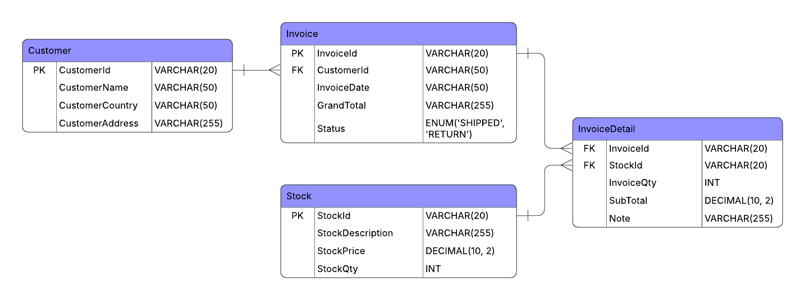

# AOL Database: Tokopee
Project: AOL Database

## ERD


## DML
### Query 1
New Product. Add a new, never-before-seen product to the database.
```sql
INSERT INTO Stock(StockId, StockDescription, StockPrice, StockQty)  
VALUES ('M0416', 'Moses Car', 100.12, 10),  
       ('S0023', 'Stefanus Car', 138.44, 20),  
       ('N0007', 'Nicho PC', 420.69, 100);

```
Add 3 new product to the stock

### Query 2
Customer Order. Write the series of statements required for an existing customer to order two different products in a single transaction.
```sql
INSERT INTO Invoice(InvoiceId, CustomerId, InvoiceDate, GrandTotal, Status)  
VALUES ('2034534', '12785', CURRENT_TIMESTAMP(), (100.12 * 5) + (420.69 * 10), 'SHIPPED');  
  
INSERT INTO InvoiceDetail(InvoiceId, StockId, InvoiceQty, SubTotal, Note)  
VALUES ('2034534', 'M0416', 5, 100.12 * 5, 'COD'),  
       ('2034534', 'N0007', 10, 420.69 * 10, 'RTX5090');  
 
# Before adding trigger 
UPDATE Stock  
SET StockQty = StockQty - 5  
WHERE StockId = 'M0416';  
  
UPDATE Stock  
SET StockQty = StockQty - 10  
WHERE StockId = 'N0007';
```
### Query 3
Customer Return. Write the statements required to process a return for one of the items from the order you created above.
```sql
INSERT INTO Invoice(InvoiceId, CustomerId, InvoiceDate, GrandTotal, Status)  
VALUES ('C2034534', '12785', CURRENT_TIMESTAMP(), (100.12 * 5) + (420.69 * 10), 'RETURN');  
  
INSERT INTO InvoiceDetail(InvoiceId, StockId, InvoiceQty, SubTotal, Note)  
VALUES ('2034534', 'M0416', 5, 100.12 * 5, 'Broken from the start'),  
       ('2034534', 'N0007', 10, 420.69 * 10, 'Super dirty');  

# Before adding trigger 
UPDATE Stock  
SET StockQty = StockQty + 5  
WHERE StockId = 'M0416';  
  
UPDATE Stock  
SET StockQty = StockQty + 10  
WHERE StockId = 'N0007';
```
### Query 4
Analytical Report. Write a query to find the top 10 customers by total money spent.
```sql
SELECT i.CustomerId, c.CustomerName, SUM(i.GrandTotal) AS TotalSpending  
FROM Invoice i  
         INNER JOIN Customer c ON i.CustomerId = c.CustomerId  
WHERE NOT (i.CustomerId = 'default')  
  AND i.Status = 'SHIPPED'  
GROUP BY i.CustomerId  
ORDER BY TotalSpending DESC  
LIMIT 10;
```


### Query 5

```sql
SELECT MONTH(InvoiceDate) AS Month, SUM(GrandTotal) AS SalesRevenue  
FROM Invoice i  
WHERE i.Status = 'SHIPPED'  
  AND YEAR(InvoiceDate) = 2011  
GROUP BY MONTH(InvoiceDate)  
ORDER BY MONTH(InvoiceDate);
```

## Advance
### Trigger
Create a trigger that automatically updates the inventory level of a product whenever a transaction (sale or return) involving that product is recorded.
```sql
CREATE TRIGGER onInvoiceDetailInsertQty  
    AFTER INSERT  
    ON InvoiceDetail  
    FOR EACH ROW  
BEGIN  
    DECLARE v_status ENUM ('SHIPPED', 'RETURN');  
  
    SELECT Status  
    INTO v_status  
    FROM Invoice  
    WHERE InvoiceId = NEW.InvoiceId;  
  
    IF v_status = 'RETURN' THEN  
        UPDATE Stock  
        SET StockQty = StockQty + NEW.InvoiceQty  
        WHERE StockId = NEW.StockId;  
    ELSE  
        UPDATE Stock  
        SET StockQty = StockQty - NEW.InvoiceQty  
        WHERE StockId = NEW.StockId;  
    END IF;  
END;  
  
CREATE TRIGGER onInvoiceDetailDeleteQty  
    AFTER DELETE  
    ON InvoiceDetail  
    FOR EACH ROW  
BEGIN  
    DECLARE v_status ENUM ('SHIPPED', 'RETURN');  
  
    SELECT Status  
    INTO v_status  
    FROM Invoice  
    WHERE InvoiceId = OLD.InvoiceId;  
  
    IF v_status = 'RETURN' THEN  
        UPDATE Stock  
        SET StockQty = StockQty - OLD.InvoiceQty  
        WHERE StockId = OLD.StockId;  
    ELSE  
        UPDATE Stock  
        SET StockQty = StockQty + OLD.InvoiceQty  
        WHERE StockId = OLD.StockId;  
    END IF;  
END;  
  
CREATE TRIGGER onInvoiceDetailUpdateQty  
    AFTER UPDATE  
    ON InvoiceDetail  
    FOR EACH ROW  
BEGIN  
    DECLARE v_status ENUM ('SHIPPED', 'RETURN');  
  
    SELECT Status  
    INTO v_status  
    FROM Invoice  
    WHERE InvoiceId = OLD.InvoiceId;  
  
    IF v_status = 'RETURN' THEN  
        UPDATE Stock  
        SET StockQty = StockQty - OLD.InvoiceQty  
        WHERE StockId = OLD.StockId;  
  
        UPDATE Stock  
        SET StockQty = StockQty + NEW.InvoiceQty  
        WHERE StockId = NEW.StockId;  
    ELSE  
        UPDATE Stock  
        SET StockQty = StockQty + OLD.InvoiceQty  
        WHERE StockId = OLD.StockId;  
  
        UPDATE Stock  
        SET StockQty = StockQty - NEW.InvoiceQty  
        WHERE StockId = NEW.StockId;  
    END IF;  
END;
```
3 Trigger is added for stock tracking.
In case of new shipped item:
- Insert: Stock number is subtracted
- Delete: Stock number is added
- Update: Old Stock number is added while new stock number is subtracted
In case of new return item:
- Insert: Stock number is added 
- Delete: Stock number is subtracted
- Update: Old Stock number is subtracted while new stock number is added
### Stored Procedure
Create a stored procedure named GetCustomerInvoiceHistory that accepts a CustomerID as input and returns a complete list of all invoices (including the date and total value) belonging to that customer.

```sql
CREATE PROCEDURE GetCustomerInvoiceHistory(IN p_CustomerID VARCHAR(20))  
BEGIN  
    SELECT InvoiceId,  
           InvoiceDate,  
           GrandTotal,  
           Status  
    FROM Invoice  
    WHERE CustomerId = p_CustomerID  
    ORDER BY InvoiceDate DESC; 
END
```
